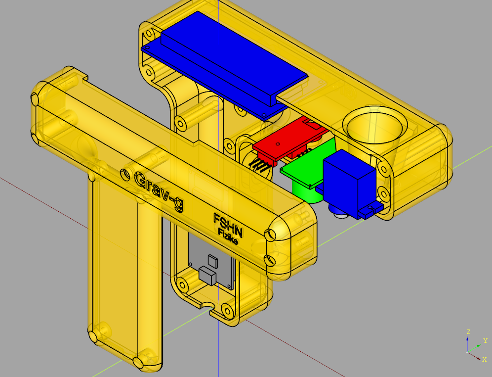
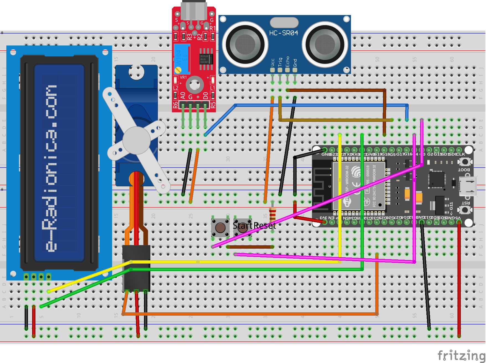

# Grav-g meter

This is a DIY instrument to measure the gravity **g** using the free fall. It accurately measures the height   with an HC-SR04 ultrasonic sensor and the free fall time by utilizing a KY-037 sound trigger sensor. 

#### Here you find:

1. A CADquery 3D parametrized model to generate 3D printed parts
2. A Fritzing circuit file that shows all the electrical connections between all the parts
3. Firmware files written in Micropython

#### Parts

* ESP32 microcontroller 
* a 16x2 LCD with I2C connection 
* an HC-SR04 ultrasonic distance sensor
* a KY-037 high sensitivity sound detection module
* a servo motor SG90
* two push buttons

